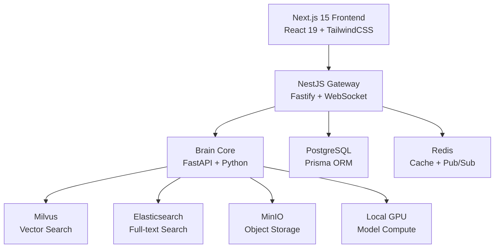

# DreamHelper

```text
██████╗ ██████╗ ███████╗ █████╗ ███╗   ███╗██╗  ██╗███████╗██╗     ██████╗ ███████╗██████╗ 
██╔══██╗██╔══██╗██╔════╝██╔══██╗████╗ ████║██║  ██║██╔════╝██║     ██╔══██╗██╔════╝██╔══██╗
██║  ██║██████╔╝█████╗  ███████║██╔████╔██║███████║█████╗  ██║     ██████╔╝█████╗  ██████╔╝
██║  ██║██╔══██╗██╔══╝  ██╔══██║██║╚██╔╝██║██╔══██║██╔══╝  ██║     ██╔═══╝ ██╔══╝  ██╔══██╗
██████╔╝██║  ██║███████╗██║  ██║██║ ╚═╝ ██║██║  ██║███████╗███████╗██║     ███████╗██║  ██║
╚═════╝ ╚═╝  ╚═╝╚══════╝╚═╝  ╚═╝╚═╝     ╚═╝╚═╝  ╚═╝╚══════╝╚══════╝╚═╝     ╚══════╝╚═╝  ╚═╝
                                                                                           
```

<p align="center">
  <strong>DREAMVFIA AI Assistant | Cyberpunk Theme | 100+ Skills | 5 Agents | Local GPU Accelerated</strong>
</p>

<p align="center">
  
</p>

<p align="center">
  <a href="https://github.com/DREAMVFIAUNION/dreamhelper-v3">
    
  </a>
  <a href="https://github.com/DREAMVFIAUNION/dreamhelper-v3">
    
  </a>
  <a href="https://github.com/DREAMVFIAUNION/dreamhelper-v3/releases">
    
  </a>
  
  
  
  
</p>

<p align="center">
  <a href="#quick-start"><strong>Quick Start</strong></a> |
  <a href="#system-architecture"><strong>Architecture</strong></a> |
  <a href="#api-endpoints"><strong>API</strong></a> |
  <a href="#skills-overview"><strong>Skills</strong></a>
</p>

---

## Overview

DREAMVFIA is an enterprise-grade AI assistant platform built around a **Next.js frontend**, **NestJS gateway**, and **Python FastAPI brain core**. It combines conversational AI, multimodal processing, knowledge retrieval, workflow execution, and a large built-in skill ecosystem into one deployable system.

### Highlights at a glance

| Area | What you get |
|------|---------------|
| Multi-agent runtime | ReAct, Code, Writing, Analysis, and PlanExecute agents |
| Skill ecosystem | 100+ built-in skills across daily, office, coding, document, image, audio, and video workflows |
| AI capabilities | RAG knowledge base, tool calling, multimodal understanding, workflow automation |
| Infra | PostgreSQL, Redis, Milvus, Elasticsearch, MinIO, WebSocket, local GPU support |
| Product UX | Cyberpunk-themed UI, realtime chat, session persistence, admin features |

---

## Demo Videos

| Demo | Preview |
|------|---------|
| YouTube Shorts Demo | <a href="https://youtube.com/shorts/sBnOLkFhz-I?si=4K-JQQNdQtD3DQ2Z"></a> |
| YouTube Full Demo | <a href="https://www.youtube.com/watch?v=Yct5YYgZeJU&t=277s"></a> |

---

## Key Features

- **5 specialized agents** for reasoning, coding, writing, analysis, and planning workflows
- **100+ built-in skills** covering productivity, coding, documents, media, and automation
- **Local GPU acceleration** for high-performance AI inference and multimodal workloads
- **RAG knowledge system** backed by Milvus + Elasticsearch for semantic and keyword retrieval
- **Multimodal capabilities** including STT, TTS, document parsing, and vision processing
- **Realtime architecture** with WebSocket support and persistent chat sessions
- **Enterprise-oriented stack** with gateway, auth, caching, storage, and structured service boundaries
- **Cyberpunk product experience** with animated UI and dark-mode-first styling

### Agent System

| Agent | Capability | Use Case |
|-------|------------|----------|
| ReAct | Tool calling + reasoning | Multi-step task execution |
| Code | Code generation / execution | Software development |
| Writing | Structured content creation | Content generation |
| Analysis | Data analysis and insights | Business intelligence |
| PlanExecute | Planning and execution loops | Complex task orchestration |

### Product Experience

<p align="center">
  
</p>

---

<a id="system-architecture"></a>

## System Architecture



### Architecture layers

| Layer | Responsibility |
|-------|----------------|
| Frontend | Chat UI, product surfaces, interaction flows, cyberpunk-themed experience |
| Gateway | Auth, transport, WebSocket communication, channel access, API orchestration |
| Brain Core | Agent runtime, tools, workflows, multimodal processing, RAG, memory |
| Data & Infra | PostgreSQL, Redis, Milvus, Elasticsearch, MinIO, GPU execution |

---

## Tech Stack

| Layer | Technology |
|-------|------------|
| Frontend | Next.js 15, React 19, TailwindCSS, Framer Motion |
| Gateway | NestJS 10, Fastify, WebSocket |
| AI Core | Python 3.12, FastAPI, Pydantic |
| Database | PostgreSQL 17, Prisma ORM, Redis 8 |
| Search | Milvus 2.4, Elasticsearch 8 |
| Deploy | Docker Compose (7 Containers) |
| Testing | Vitest, Pytest, Playwright |

---

<a id="skills-overview"></a>

## 100+ Skills Overview

| Category | Count | Example Skills |
|----------|-------|----------------|
| Daily | 15 | `calculator`, `unit_converter`, `password_generator`, `bmi_calculator` |
| Office | 15 | `todo_manager`, `pomodoro_timer`, `csv_analyzer`, `invoice_generator` |
| Coding | 15 | `base64_codec`, `url_codec`, `jwt_decoder`, `sql_formatter`, `code_formatter` |
| Document | 13 | `markdown_processor`, `text_statistics`, `text_summarizer`, `word_counter` |
| Entertainment | 12 | `fortune_teller`, `name_generator`, `ascii_art`, `sudoku_solver` |
| Image | 12 | `image_resize`, `image_watermark`, `image_filter`, `image_collage` |
| Audio | 10 | `audio_convert`, `audio_trim`, `audio_merge`, `audio_volume` |
| Video | 8 | `video_thumbnail`, `video_trim`, `video_merge`, `video_to_gif` |

> The skill system is designed to auto-route user requests to the right tool chain for practical everyday and professional workflows.

---

<a id="quick-start"></a>

## Quick Start

### Prerequisites

```bash
Node.js >= 20
pnpm >= 9
Python >= 3.12
Docker + Docker Compose
```

### 1. Clone Project

```bash
git clone https://github.com/DREAMVFIAUNION/dreamhelper-v3.git
cd dreamhelper-v3
```

### 2. Install Dependencies

```bash
# Frontend dependencies
pnpm install

# AI Core dependencies
cd services/brain-core
pip install -r requirements.txt
```

### 3. Configure Environment

```bash
cp .env.example .env
# Edit .env with your config
```

### 4. Start Docker Services

```bash
docker compose up -d postgres redis milvus es minio
```

### 5. Initialize Database

```bash
pnpm db:migrate
pnpm db:seed
```

### 6. Start Development

```bash
# Frontend (http://localhost:3000)
pnpm --filter web-portal dev

# AI Core (http://localhost:8000)
cd services/brain-core
uvicorn src.main:app --reload --port 8000

# Gateway (Optional) (http://localhost:3001)
pnpm --filter gateway dev
```

### 7. One-Click Start (Docker)

```bash
docker compose up -d
# Visit http://localhost:3000
```

---

<a id="api-endpoints"></a>

## API Endpoints

| Module | Endpoint | Purpose |
|--------|----------|---------|
| Auth | `POST /api/auth/login` | User login |
| Auth | `POST /api/auth/register` | User registration |
| Auth | `POST /api/auth/logout` | User logout |
| Auth | `PUT /api/auth/password` | Change password |
| Chat | `POST /api/chat/completion` | AI chat completion |
| Chat | `GET/POST /api/chat/session` | Session management |
| Knowledge | `POST /api/knowledge/upload` | Upload documents |
| Knowledge | `GET /api/knowledge/list` | List knowledge items |
| Multimodal | `POST /api/multimodal/stt` | Speech to text |
| Multimodal | `POST /api/multimodal/tts` | Text to speech |

---

## Feature Demos

### AI Chat

```python
# User Input
user: "Write a poem about starlight"

# AI Response
Stars twinkle in the deep night sky,
Milky Way reflects a dreamy eye.
Vast universe so endless and bright,
Gazing up, my thoughts take flight.
```

### Image Processing

```bash
# User: "Add watermark to this image"
# Auto calls image_watermark skill
# Returns processed image
```

### Data Analysis

```bash
# User: "Analyze this sales data"
# AI auto calls csv_analyzer
# Returns visualization report
```

---

## Connect With Us

<p align="center">
  <a href="https://github.com/DREAMVFIAUNION">
    
  </a>
</p>

---

## Project Stats

<p align="center">


</p>

---

## Contributing

Welcome to submit Issues and Pull Requests.

```bash
# 1. Fork the project
# 2. Create feature branch
git checkout -b feature/AmazingFeature
# 3. Commit changes
git commit -m 'Add some AmazingFeature'
# 4. Push branch
git push origin feature/AmazingFeature
# 5. Open Pull Request
```

---

## License

```text
Copyright (c) 2026 DREAMVFIA UNION
All Rights Reserved
```

---

<p align="center">
  
</p>

<p align="center">
  <sub>Copyright 2026 DREAMVFIA UNION | Built for the future of AI assistants</sub>
</p>
